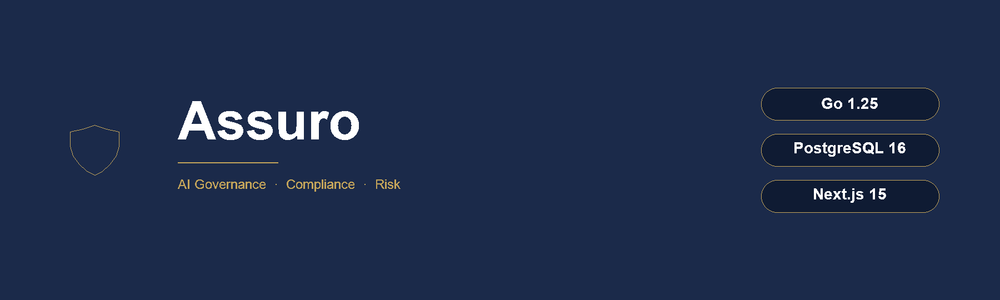
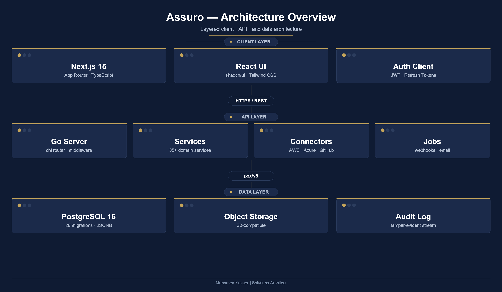

<div align="center">



<br/><br/>

[](LICENSE)
[](https://go.dev)
[](https://postgresql.org)
[](https://nextjs.org)
[](CONTRIBUTING.md)

**Self-hostable AI governance, compliance, and risk management platform.**

[Overview](#overview) · [Features](#features) · [Architecture](#architecture) · [Quick Start](#quick-start) · [Configuration](#configuration) · [API Reference](#api-reference) · [Modules](#modules) · [Deployment](#deployment) · [Contributing](#contributing)

</div>

---

## Overview

Assuro is an open-source platform for organisations that operate AI systems under regulatory frameworks. It covers the full governance lifecycle: registering AI systems, computing risk scores, mapping controls to compliance frameworks, collecting audit evidence, tracking incidents, and generating reports that satisfy external auditors.

The platform is built as a Go modular monolith backed by PostgreSQL and a Next.js frontend. Everything runs in a single Docker Compose stack with no external dependencies, making it straightforward to self-host in air-gapped or regulated environments.

### Why Assuro

Most governance tools are either spreadsheets that break at scale or enterprise SaaS products that require sharing sensitive AI system data with a third party. Assuro sits in the middle: structured, auditable, and fully under your control.

- **Regulatory coverage out of the box.** EU AI Act, NIST AI RMF 1.0, and ISO/IEC 42001 are pre-loaded with control mappings.
- **Single deployment, no external services required.** The only dependency is PostgreSQL.
- **Audit-ready from day one.** Every mutation is written to a tamper-evident audit log with SHA-256 hashes on generated reports.
- **Extensible connector framework.** Scan AWS Bedrock, Azure AI, GCP Vertex AI, GitHub repositories, and HuggingFace Hub to discover shadow AI automatically.

---

## Features

### Core Governance

#### AI System Registry
Register every AI system, pipeline, or model in your organisation with structured metadata: name, version, description, owner, deployment environment, and purpose. Each system is assigned a risk classification tier based on EU AI Act categories (minimal, limited, high, unacceptable) and linked to its underlying assets.

#### Risk Engine
The risk engine computes a weighted risk score for each asset based on assessment findings, incident history, and monitoring data. Scores are stored historically so you can track how risk evolves over time. The dashboard surfaces the current risk tier distribution (critical, high, medium, low, unknown) across all assets in your organisation.

#### Cross-Framework Compliance Register
Assuro ships with a Statement of Applicability (SoA) system that maps your assets and controls to multiple regulatory frameworks simultaneously. Each control record tracks implementation status (implemented, partially implemented, not applicable, not implemented) and links to evidence artefacts. The compliance score is calculated automatically as `(implemented + 0.5 * partial) / total * 100`.

Supported frameworks:
- EU AI Act 2024
- NIST AI Risk Management Framework 1.0
- ISO/IEC 42001:2023

#### Assessment Workflows
Assessments are structured questionnaires tied to a specific AI system and framework version. Each assessment goes through a defined lifecycle: draft, in-review, completed, approved. Assessors attach evidence files (documents, screenshots, API responses) and the platform tracks which version of the framework each assessment was conducted against.

#### Continuous Monitoring
Define threshold-based monitoring rules for metrics such as performance scores, data drift indicators, and uptime. When a metric breaches a threshold, Assuro creates an alert and can trigger notifications or webhook deliveries to your existing tooling.

#### Incident and CAPA Management
Log AI-related incidents with severity levels, root cause categories, and affected systems. Attach corrective and preventive action (CAPA) records to each incident, assign owners, and track resolution status. Unresolved incidents older than the configured SLA automatically surface in the analytics dashboard.

#### Report Generation
Generate compliance reports in JSON or PDF format. Each report includes a SHA-256 hash of its content so you can prove to auditors that the document has not been modified after generation. Reports can be scoped to a single framework, a single asset, or the entire organisation.

---

### Extended Modules

#### Agent Registry and Runtime
Register autonomous AI agents alongside human-operated AI systems. The registry tracks agent type (autonomous, assistant, pipeline, custom), status, and capability scope. The runtime layer adds:

- Behaviour logging with outcome classification (ok, error, blocked, anomaly)
- Guardrail policies with configurable actions (block, warn, log)
- Anomaly records with severity tiers (low, medium, high, critical) and resolution tracking
- A kill-switch endpoint that immediately suspends an agent and writes a timestamped audit entry

#### Shadow AI Discovery
Organisations routinely run AI systems that were never formally registered. The discovery module addresses this through a connector framework that scans cloud AI platforms and code repositories. Discovered items are written to a deduplication inbox using SHA-256 keys on (org, source, external-id) tuples, preventing duplicate entries on repeated scans. Reconcile inbox items against the asset registry to identify genuine shadow AI.

Built-in connectors:

| Connector | What it scans |
|---|---|
| AWS Bedrock | Foundation models in the configured region |
| Azure AI | Models deployed in the configured workspace |
| GCP Vertex AI | Models in the configured project and location |
| GitHub | Repositories with Python/Jupyter files or AI keywords (ml, llm, gpt, bert, embedding, inference) |
| HuggingFace Hub | Public models associated with the configured organisation |

All connectors implement a static fallback that returns representative models when credentials are absent, keeping tests deterministic without mocking.

#### Vendor Risk Management
Maintain an inventory of third-party AI vendors categorised by type (ai_provider, data_provider, platform, tools, custom). Create vendor assessments with risk scoring and the platform automatically updates the vendor's risk tier to match the latest assessment result. Track renewal dates, contract metadata, and open assessment findings per vendor.

#### Policy Management
Create and manage AI governance policies through a structured workflow: draft, in-review, approved, archived. Each approved policy version records attestations from designated users, providing a signed acceptance trail. Policies link to relevant frameworks, assets, and controls for full traceability.

#### Model Cards
Generate and version structured model documentation following the model card standard. Each card covers intended use, limitations, performance metrics, training data, ethical considerations, and maintenance information. Cards are versioned and linked to the corresponding AI system and asset records.

#### Model Testing
Define test suites by category (functional, bias, robustness, security, custom) and attach individual test cases with expected outcomes. When a test run completes, the platform calculates a percentage score (`passed / total * 100`) and stores per-case results (pass, fail, error, skip). Failed test runs can trigger alerts and feed into risk score adjustments.

#### Approval Gates
Configure multi-stakeholder approval workflows for high-stakes decisions such as deploying a new AI system or approving a risk exception. Each workflow specifies required approvers and a minimum approval count. The gate transitions automatically: any single rejection marks the request as rejected; reaching the required approval count marks it as approved. All decisions are immutable and written to the audit log.

#### Task Management
Create and assign remediation and review tasks linked to any resource in the system (asset, incident, finding, vendor). Tasks carry priority levels (critical, high, medium, low), due dates, status (open, in-progress, blocked, done, cancelled), and a comment thread. The task list is sorted by priority using a deterministic weight function.

#### Analytics Dashboard
A single API endpoint aggregates metrics across all modules into a structured snapshot:

- Risk tier distribution from the latest score per asset
- Compliance score from the SoA control status breakdown
- Incident trend by month for the past six months
- Task summary by status and overdue count
- Scalar counts for active agents, open shadow AI findings, active vendors, and approved policies

#### Audit Log
Every state change in Assuro writes a structured event to the audit log with actor, target type, target ID, action, and a JSON payload. The log supports filtering by action, target type, target ID, actor, and date range. Export the filtered result as CSV for submission to external auditors or SIEM ingestion.

#### Role-Based Access Control
In addition to the built-in system roles (owner, admin, member), you can create custom org-scoped roles and assign fine-grained permissions. There are 30+ permission scopes covering every domain:

```
assets:read          assets:write         assets:delete
risks:read           risks:write
incidents:read       incidents:write
policies:read        policies:write       policies:approve
vendors:read         vendors:write
agents:read          agents:write         agents:kill
tasks:read           tasks:write
audit:read           audit:export
analytics:read
approvals:read       approvals:decide
users:read           users:invite         users:manage
connectors:read      connectors:write
model_cards:read     model_cards:write
shadow_ai:read       shadow_ai:manage
```

#### Notifications and Webhooks
In-app notifications are created for configurable event categories with severity levels (info, warning, error, critical). Users set per-category preferences for in-app and email delivery. Webhook endpoints register a URL and an optional event filter; Assuro dispatches HTTP POST requests asynchronously and records each delivery attempt (status code, error message, timestamp) so you can diagnose delivery failures.

#### Data Export and Import
Export your full org dataset as a structured JSON file for backup, migration, or offline analysis. The export covers assets, vendors, policies, agents, and incidents. Assets can also be exported as CSV. Bulk import endpoints accept arrays of asset or vendor records and skip duplicates on conflict, returning a per-row count of created and skipped records.

---

## Architecture

<div align="center">

</div>

<br/>

The backend is a Go modular monolith using chi for routing, pgx/v5 for PostgreSQL access, sqlc for generated type-safe queries, goose for migrations, and zap for structured logging. Services are plain Go structs that take a `*store.DB` and expose context-aware methods; there is no DI framework.

The frontend is a Next.js 15 App Router application with TypeScript strict mode and Tailwind CSS. It communicates with the backend exclusively over the versioned REST API.

| Layer | Technology |
|---|---|
| Frontend | Next.js 15 · React · TypeScript strict · Tailwind CSS · shadcn/ui |
| Backend | Go 1.25 · chi v5 · pgx/v5 · sqlc · goose · zap |
| Database | PostgreSQL 16 with 28 migrations, JSONB columns, and UUID primary keys |
| Auth | JWT access and refresh tokens with argon2id password hashing |
| Background jobs | Lightweight in-process queue for email, webhooks, and async risk recompute |
| Deployment | Docker Compose with Caddy as a TLS-terminating reverse proxy |

---

## Quick Start

**Prerequisites:** Go 1.25+, Node.js 20+, Docker, Docker Compose

```bash
# Clone the repository
git clone https://github.com/YASSERRMD/Assuro.git
cd Assuro

# Start PostgreSQL
make docker-up

# Run all 28 database migrations
make migrate-up

# Start the API server on port 8080
make run
```

In a separate terminal:

```bash
# Install frontend dependencies and start the dev server on port 3000
cd web
npm install
npm run dev
```

Open `http://localhost:3000` in your browser. Register an account to create your first organisation.

---

## Configuration

All configuration is provided through environment variables. A `.env.example` file is included in the repository root.

### Required

| Variable | Description |
|---|---|
| `DATABASE_URL` | PostgreSQL connection string |
| `JWT_SECRET` | Secret used to sign and verify JWT tokens. Use a minimum 32-character random string in production. |

### Optional

| Variable | Default | Description |
|---|---|---|
| `PORT` | `8080` | TCP port the API server listens on |
| `LOG_LEVEL` | `info` | Logging level: debug, info, warn, error |
| `ALLOWED_ORIGINS` | `*` | Comma-separated list of allowed CORS origins |
| `OPENAI_API_KEY` | (empty) | Enables the AI Assist feature for natural-language queries |
| `AWS_REGION` | (empty) | AWS region for the Bedrock connector |
| `BEDROCK_PROFILE` | (empty) | AWS profile to use for Bedrock authentication |
| `AZURE_AI_ENDPOINT` | (empty) | Azure AI Services endpoint URL |
| `AZURE_AI_KEY` | (empty) | Azure AI Services API key |
| `GCP_PROJECT` | (empty) | GCP project ID for the Vertex AI connector |
| `GCP_LOCATION` | (empty) | GCP region for Vertex AI (e.g. us-central1) |
| `GITHUB_TOKEN` | (empty) | GitHub personal access token for the GitHub connector |
| `HF_TOKEN` | (empty) | HuggingFace API token for the HuggingFace connector |
| `SMTP_HOST` | (empty) | SMTP host for email notifications |
| `SMTP_PORT` | `587` | SMTP port |
| `SMTP_USER` | (empty) | SMTP username |
| `SMTP_PASS` | (empty) | SMTP password |
| `FROM_EMAIL` | (empty) | Sender address for notification emails |

---

## API Reference

All endpoints require a `Bearer` JWT token in the `Authorization` header unless noted. The token is obtained from `POST /v1/auth/login`. Pagination uses `limit` and `offset` query parameters.

### Authentication

| Method | Endpoint | Description |
|---|---|---|
| `POST` | `/v1/auth/register` | Register a new organisation and owner account |
| `POST` | `/v1/auth/login` | Sign in and receive access and refresh tokens |
| `POST` | `/v1/auth/refresh` | Exchange a refresh token for a new access token |
| `POST` | `/v1/auth/logout` | Revoke the current refresh token |

### AI Systems and Assets

| Method | Endpoint | Description |
|---|---|---|
| `GET` | `/v1/ai-systems` | List all AI systems in the org |
| `POST` | `/v1/ai-systems` | Register a new AI system |
| `GET` | `/v1/ai-systems/{id}` | Get a single AI system with its risk profile |
| `PATCH` | `/v1/ai-systems/{id}` | Update AI system metadata |
| `GET` | `/v1/assets` | List all assets |
| `POST` | `/v1/assets` | Create a new asset |
| `GET` | `/v1/assets/{id}` | Get a single asset |
| `GET` | `/v1/analytics/assets/{id}/risk-trend` | Get risk score history for an asset |

### Risk and Assessments

| Method | Endpoint | Description |
|---|---|---|
| `GET` | `/v1/risks` | List risk scores |
| `POST` | `/v1/risks/compute` | Trigger risk score recomputation |
| `GET` | `/v1/assessments` | List assessments |
| `POST` | `/v1/assessments` | Start a new assessment |
| `GET` | `/v1/assessments/{id}` | Get assessment with findings |
| `PATCH` | `/v1/assessments/{id}/status` | Advance assessment lifecycle |

### Compliance

| Method | Endpoint | Description |
|---|---|---|
| `GET` | `/v1/frameworks` | List available compliance frameworks |
| `GET` | `/v1/frameworks/{id}/controls` | List controls for a framework |
| `GET` | `/v1/soa` | Get the Statement of Applicability |
| `PATCH` | `/v1/soa/{control_id}` | Update control implementation status |

### Incidents and Monitoring

| Method | Endpoint | Description |
|---|---|---|
| `GET` | `/v1/incidents` | List incidents |
| `POST` | `/v1/incidents` | Log a new incident |
| `PATCH` | `/v1/incidents/{id}/status` | Update incident status |
| `GET` | `/v1/monitoring/rules` | List monitoring rules |
| `POST` | `/v1/monitoring/rules` | Create a monitoring rule |
| `POST` | `/v1/monitoring/metrics` | Ingest a metric reading |

### Agents

| Method | Endpoint | Description |
|---|---|---|
| `GET` | `/v1/agents` | List registered agents |
| `POST` | `/v1/agents` | Register a new agent |
| `GET` | `/v1/agents/{id}` | Get agent details |
| `POST` | `/v1/agents/{id}/behavior` | Record a behaviour log entry |
| `POST` | `/v1/agents/{id}/kill` | Suspend an agent immediately |
| `GET` | `/v1/agents/{id}/anomalies` | List anomalies for an agent |

### Vendors, Policies and Tasks

| Method | Endpoint | Description |
|---|---|---|
| `GET` | `/v1/vendors` | List vendors |
| `POST` | `/v1/vendors` | Add a vendor |
| `POST` | `/v1/vendors/{id}/assessments` | Create a vendor assessment |
| `GET` | `/v1/policies` | List policies |
| `POST` | `/v1/policies` | Create a policy |
| `PATCH` | `/v1/policies/{id}/status` | Advance policy lifecycle |
| `GET` | `/v1/tasks` | List tasks with optional filters |
| `POST` | `/v1/tasks` | Create a task |
| `PATCH` | `/v1/tasks/{id}/status` | Update task status |
| `POST` | `/v1/tasks/{id}/comments` | Add a comment |

### Analytics and Audit

| Method | Endpoint | Description |
|---|---|---|
| `GET` | `/v1/analytics/dashboard` | Cross-domain metrics snapshot |
| `GET` | `/v1/audit-log` | Filterable audit event stream |
| `GET` | `/v1/audit-log/export` | Download audit log as CSV |
| `GET` | `/v1/audit-log/actions` | List all known audit action types |

### Notifications and Webhooks

| Method | Endpoint | Description |
|---|---|---|
| `GET` | `/v1/notifications` | List in-app notifications for the current user |
| `GET` | `/v1/notifications/unread-count` | Get unread notification count |
| `POST` | `/v1/notifications/read-all` | Mark all notifications as read |
| `GET` | `/v1/notifications/preferences` | Get per-category notification preferences |
| `PUT` | `/v1/notifications/preferences` | Update notification preferences |
| `GET` | `/v1/webhooks` | List webhook endpoints |
| `POST` | `/v1/webhooks` | Register a webhook endpoint |
| `DELETE` | `/v1/webhooks/{id}` | Remove a webhook endpoint |
| `GET` | `/v1/webhooks/{id}/deliveries` | View delivery log for a webhook |

### RBAC

| Method | Endpoint | Description |
|---|---|---|
| `GET` | `/v1/roles` | List custom roles |
| `POST` | `/v1/roles` | Create a custom role |
| `DELETE` | `/v1/roles/{id}` | Delete a role |
| `GET` | `/v1/roles/{id}/permissions` | List permissions on a role |
| `POST` | `/v1/roles/{id}/permissions` | Grant a permission to a role |
| `DELETE` | `/v1/roles/{id}/permissions/{permission}` | Revoke a permission |
| `GET` | `/v1/users/{id}/roles` | List roles assigned to a user |
| `POST` | `/v1/users/{id}/roles` | Assign a role to a user |

### Export and Import

| Method | Endpoint | Description |
|---|---|---|
| `GET` | `/v1/export` | Download full org dataset as JSON |
| `GET` | `/v1/export/assets.csv` | Download all assets as CSV |
| `POST` | `/v1/import/assets` | Bulk-insert assets, skipping duplicates |
| `POST` | `/v1/import/vendors` | Bulk-insert vendors, skipping duplicates |

---

## Project Structure

```
Assuro/
├── cmd/
│   └── server/               # Main entrypoint (main.go)
├── internal/
│   ├── api/                  # HTTP handlers (31 files, one per domain)
│   ├── service/              # Business logic services (35+ files)
│   ├── store/                # Database connection and pgxpool wrapper
│   │   └── queries/
│   │       ├── generated/    # sqlc-generated type-safe query code
│   │       └── sql/          # Raw SQL query files for sqlc
│   ├── auth/                 # JWT generation, verification, middleware
│   ├── connectors/           # Cloud AI connectors (AWS, Azure, GCP, GitHub, HF)
│   ├── notify/               # In-app notification service and webhook dispatcher
│   ├── jobs/                 # Background job queue interface and worker
│   ├── risk/                 # Risk scoring engine
│   ├── report/               # PDF and JSON report builder
│   ├── aiassist/             # OpenAI-backed natural language query handler
│   └── observability/        # OpenTelemetry setup
├── migrations/               # 28 goose SQL migration files
├── web/                      # Next.js 15 App Router frontend
│   ├── app/                  # Page and layout components (App Router)
│   ├── components/           # Reusable UI components
│   └── lib/                  # API client, hooks, utilities
├── docs/                     # Deployment guides and architecture assets
├── Dockerfile                # API server container image
├── Dockerfile.web            # Frontend container image
├── docker-compose.yml        # Local development stack
├── docker-compose.prod.yml   # Production stack with Caddy
├── Caddyfile                 # Caddy TLS and reverse proxy config
├── Makefile                  # Common development commands
└── sqlc.yaml                 # sqlc code generation config
```

---

## Deployment

### Local development

```bash
make docker-up      # start PostgreSQL in Docker
make migrate-up     # apply all migrations
make run            # start API server

cd web && npm run dev   # start frontend dev server
```

### Production with Docker Compose

```bash
# Copy and fill in the production environment file
cp .env.example .env

# Start the full stack with TLS via Caddy
docker compose -f docker-compose.prod.yml up -d

# Run migrations inside the running API container
docker compose exec api ./migrate up
```

The production Compose file includes:
- Caddy for automatic TLS certificate provisioning and HTTPS termination
- Health checks on both the API and PostgreSQL containers
- Named volumes for database data and Caddy certificates
- Restart policies for all services

### Running database migrations manually

```bash
# Apply all pending migrations
make migrate-up

# Roll back the last migration
make migrate-down

# Check migration status
make migrate-status
```

---

## Development

### Running tests

```bash
# Run all Go tests
go test ./internal/...

# Run with race detector
go test -race ./internal/...

# Run frontend type checking
cd web && npm run type-check

# Run frontend linting
cd web && npm run lint
```

### Code generation

```bash
# Regenerate sqlc query code after editing .sql query files
make sqlc

# Rebuild the API binary
make build
```

### Makefile targets

| Target | Description |
|---|---|
| `make docker-up` | Start PostgreSQL in Docker |
| `make docker-down` | Stop and remove PostgreSQL container |
| `make migrate-up` | Apply all pending migrations |
| `make migrate-down` | Roll back the last migration |
| `make migrate-status` | Show current migration state |
| `make run` | Build and run the API server |
| `make build` | Build the API binary |
| `make test` | Run all Go tests |
| `make sqlc` | Regenerate sqlc query code |
| `make lint` | Run golangci-lint |

---

## Contributing

Contributions are welcome. Please read [CONTRIBUTING.md](CONTRIBUTING.md) for the full process.

The short version:

1. Fork the repository and create a feature branch from `main`
2. Write tests for any new service-layer behaviour
3. Ensure `go test ./internal/...` passes
4. Ensure `golangci-lint run` produces no new warnings
5. Open a pull request with a clear description of the change and why it is needed

For significant changes, open an issue first to discuss the approach before investing in implementation.

---

## License

Apache 2.0. See [LICENSE](LICENSE) for the full text.

---

<div align="center">
<sub>Mohamed Yasser | Solutions Architect</sub>
</div>
